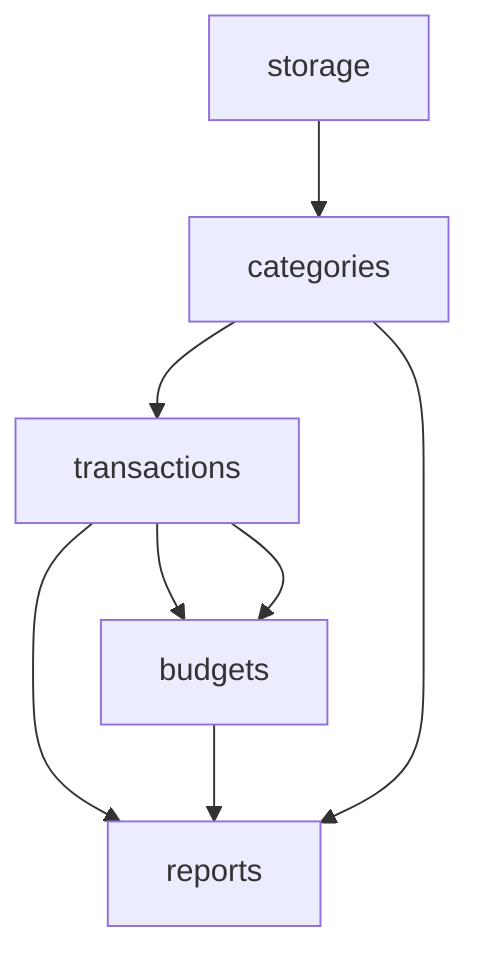

# Practical Experience & Best Practices

> Load condition: when needing to reference practical experience, or before first use

## Common Pitfalls

### Pitfall 1: Phase 1 Dependency Omission

**Phenomenon**: Phase 2 fill discovers need to call another module's interface, but not annotated in blueprint.

**Root cause**: Phase 1 only considered "main data flow" dependencies, ignored "auxiliary query" dependencies.

**Prevention**:
```
When annotating dependencies, ask two questions for each module:
1. What modules does the core logic depend on? (main data flow)
2. What modules' data are needed to translate IDs to names for output? (auxiliary query)
```

### Pitfall 2: Layer Number Intuitive Misjudgment

**Phenomenon**: Intuitively think two modules "roughly" same layer, but actually different. Like reports depends on transactions(L3) and budgets(L4), so reports=5 by formula, not 4.

**Prevention**: List each module's all direct dependencies and their layer numbers, then calculate max+1.

### Pitfall 3: Windows Encoding Crash

**Phenomenon**: Output containing ¥ and other half-width symbols crashes on Windows PowerShell 5.

**Prevention**: Use ￥ (full-width) instead of ¥ (half-width), or use ASCII text.

### Pitfall 4: Interface-level vs Dependency-level Exception Confusion

**Phenomenon**: "Missing dependency" found but cascade rollback executed, causing completed downstream modules to reset.

**Decision method**: ask "does this change alter this module's externally exposed interface signature?"

## Best Practices

### Use import path format for dependency annotation

```
Good: Dependencies: - from storage import loadData, saveData
Bad: Dependencies: storage
```

Import paths let Phase 2 fill without looking back at dependency module source code.

### CHECKPOINT.md Lightweight Tracking

Only update CHECKPOINT.md on module completion, batch update BLUEPRINT.md after same layer all complete.

### Choose mode after Phase 1 complete

Estimated interface count is usually inaccurate. Only after Phase 1 draws blueprint can you see exact number, then decide simplified/full mode.

### Runtime Verification Progressive Strategy

Test lowest-layer FLOW first → then cross-layer FLOW → finally most complex FLOW.

## Innovation Patterns

### Blueprint Snapshot

Save snapshot to `.arch/snapshots/` after each layer complete:
- High context pressure: only load current layer snapshot
- Rollback: quickly recover to某一层状态

### Interface Contract Test Auto-Generation

Auto-generate pytest from BEHAVIOR declaration pre/post/error:
- Each pre/error → one exception test
- Each post → one assertion test

### Dependency Graph Visualization

Generate dependency graph with ASCII or Mermaid in SUMMARY.md, spot circular dependencies at a glance.


